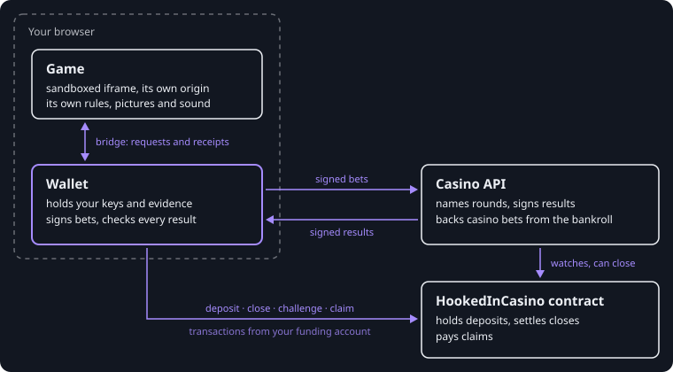

HookedIn keeps a running balance between you and the casino in a **channel**. The contract holds your deposit, every bet
is a pair of signed messages that moves the balance, and the chain is needed only to open the channel and to settle it.



The game runs in a sandboxed frame beside the wallet and asks it for bets over a message bridge. The wallet signs each
bet and sends it to the casino, which answers with a signed result. The wallet sends every on-chain transaction itself,
from your funding account: the deposit, a close, a challenge, a claim. The casino watches the contract and can close a
channel too.

## Channels

**Open.** One transaction, `openChannel(signer)`, opens a channel. It comes from your **funding account**, the account
whose ETH you deposit, and `signer` is the address of a fresh **channel key** the wallet generates for this channel. The
contract derives the channel ID as `keccak256(abi.encode(player, signer, deposit))`, records who funded the channel and
which key signs for it, and protects the deposit. The casino's permission is not needed. A funding account has one open
channel at a time: to add money, close the channel and open another. Once the deposit has two confirmations on Sepolia,
the wallet registers the channel with the casino.

**Sign.** Every change to the balance is an **operation** that the channel key signs, answered by a **checkpoint** that
the casino signs: the channel's sequence number, the hash of the state before it, a hash of the operation that led to
it, and the balance after it. The wallet re-derives the checkpoint, checks the casino's signature, countersigns it and
saves it before the game hears anything. There are three kinds of operation, and the contract knows no others:

| Kind         | Effect on the balance           | Used for                                                                                                             |
| ------------ | ------------------------------- | -------------------------------------------------------------------------------------------------------------------- |
| 1 casino bet | − stake + every prize that pays | Casino bets                                                                                                          |
| 2 debit      | − amount                        | Payments, developer bets, investing in the bankroll fund, deposits into a developer's bank                           |
| 3 credit     | + amount                        | Collecting what is owed: developer bet payouts, sold shares, developer earnings, bank withdrawals, faucet test coins |

What an operation means (which game asked for it, the group it belongs to, what it pays into or collects from) is in its
**details**, whose hash the operation signs as its `memo`. The contract never reads them; the wallet and the casino
check and keep them. [Signed messages](../reference/signed-messages.md) has every field.

**Settle.** A channel settles on-chain when it closes. The contract accepts the latest balance both sides signed, or
that balance plus one operation the channel key authorized and the casino signed. See
[closing and claims](#closing-and-claims).

## Rounds

Every casino bet is settled by a **round**, and neither side can choose its outcome:

1. The casino picks a random **secret** and names the round by its hash, `round = keccak256(secret)`.
2. The wallet signs a bet that names that round and the hash of a random **seed** of its own,
   `seedHash = keccak256(seed)`, and sends the seed with it. The casino fixed its secret before it could see the seed.
3. The casino's result reveals the secret. The wallet checks both preimages against the hashes the bet signed, and
   works out the **outcome**:

```text
outcome = low 64 bits of keccak256(abi.encode(keccak256("HOOKEDIN/OUTCOME"), seed, secret))
```

A round settles one casino bet; the reply names the channel's next round. A round is revealed even when the casino
declines its bet, so the wallet records at once what the declined bet would have paid: a casino that declined bets by
their outcome would show it on its players' receipts.

A game with a server of its own can also have the casino name rounds for it and place casino bets on them, so that many
players share one outcome; see [developer bets](../games/developer-bets.md).

## Casino bets

A casino bet is a stake paid to enter and up to 64 **prizes**, each a range of outcomes and what it pays. A prize pays
when `rangeStart ≤ outcome < rangeEnd`. Prizes may overlap, and then every prize that holds the outcome pays. One signed
bet is therefore a whole prize table: a coin flip, a Plinko board, one step of blackjack.

A coin flip that pays 1.96 times the stake:

| Term                  | Value                                                    |
| --------------------- | -------------------------------------------------------- |
| Stake                 | 0.001 ETH (`1000000000000000` wei)                       |
| Prize                 | `[0, 2^63)`, paying 0.00196 ETH (`1960000000000000` wei) |
| Chance the prize pays | 2^63 of 2^64 outcomes: 50%                               |
| Expected payout       | 0.00098 ETH                                              |
| Return                | 98.0000% of the stake                                    |

If the outcome is below 2^63 the balance moves by −0.001 + 0.00196 = +0.00096 ETH; otherwise by −0.001 ETH. The wallet
works out the return of every casino bet from its own prize table before signing it, and keeps it on the receipt
([measured return](../wallet/bets-and-receipts.md#measured-return)).

A casino bet settles against the casino's bankroll in the request that places it. The casino may decline it instead:
it then signs a **rejection**, a checkpoint that leaves the balance unchanged, and the bet costs nothing.

## Developer bets

A developer bet is a bet against the game's developer instead of the bankroll. It is a debit whose details carry `meta`,
the game's own JSON saying what the bet is. Its stake leaves your balance at once and goes into the developer's
**bank** at the casino, and the developer settles the bet later with a `Settlement` its key signs. The wallet checks
that signature and collects what it pays with a credit. There is no escrow, no deadline and no refund: what a developer
bet is paid is its developer's word ([trust model](trust-model.md#developer-bets-trust-their-developer)).

|              | Casino bet                                  | Developer bet                                |
| ------------ | ------------------------------------------- | -------------------------------------------- |
| Against      | The casino's bankroll                       | The game's developer                         |
| Settled      | In the request that places it, by its round | When the developer signs a settlement        |
| What it pays | Its prize table on the round's outcome      | What the developer's settlement says         |
| Its return   | Measured from its prize table               | None: it has no prize table                  |
| Games        | Any game                                    | A published game, whose developer settles it |

## Payments

A game can also charge a fixed amount: a **payment**, a debit to the bankroll that names the game. It settles on no
round and earns no commission. A game uses it for a charge that does not depend on chance.

## The bankroll and commission

The casino's **bankroll** backs every casino bet. The casino admits a bet only when the bankroll could take it with no
commission at all, by an exact Kelly condition over the bet's prize table. Its **commission** is then the edge the
bankroll does not need, split equally between the game's developer and the casino. Commission is the casino's
accounting, not a second debit from your balance; a bet's receipt reports it. [Economics](../reference/economics.md)
derives the rule, and [earnings](../games/earnings.md) explains what a developer collects.

Anyone with an ETH channel can move money into the bankroll and hold shares of it: the
[bankroll fund](../wallet/bankroll-fund.md).

## Closing and claims

A channel closes in one of two ways:

- **Cooperatively.** Your funding account and the casino both sign the latest state, and the contract finalizes it at
  once.
- **Unilaterally.** Either side submits its latest evidence, which starts a fixed 24-hour window. Anyone with strictly
  newer evidence can replace it before the deadline, and the deadline never moves. After it, anyone can finalize.

Finalizing records a **claim**. Up to your deposit it is protected principal: the contract returns
`min(deposit, balance)`, so losses reduce it. Anything above the deposit is **winnings**, owed from the shared bankroll
and paid first in, first out as cash arrives. Collecting is a separate transaction.
[Closing and claims](../wallet/closing-and-claims.md) walks through each step.

## Test coins

Every wallet also has a channel of **test coins**, the casino's own play money (symbol TEST, 18 decimals). A test
channel is opened at the casino alone: nothing is deposited, and its ID is a hash the contract can never produce, so
nothing about it reaches the chain and there is nothing to close. The faucet pays 100 TEST to a test channel that holds
fewer than 10, as a credit the channel's own key signs. Test coins play the same games at the same odds against the
casino's test bankroll, with the same receipts. The casino keeps every figure per asset, so ETH and TEST never add up.
The top bar switches between them ([getting started](../wallet/getting-started.md#switch-between-eth-and-test)).
