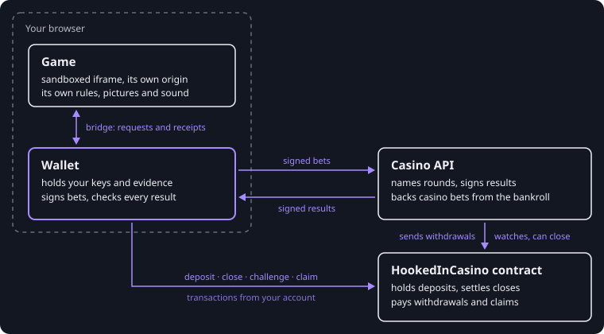

HookedIn keeps a running balance between you and the casino in a **channel**. The contract holds what you deposit,
every bet is a pair of signed messages that moves the balance, and the chain is needed only to deposit into the
channel, to pay out its withdrawals and to close it.



The game runs in a sandboxed frame beside the wallet and asks it for bets over a message bridge. The wallet signs each
bet and sends it to the casino, which answers with a signed result. The wallet sends deposits, closes, challenges and
claims to the contract itself, from your account. The casino watches the contract, sends it each withdrawal to pay,
and can close a channel too.

## Channels

**Open.** A channel belongs to an **account**: an Ethereum key the wallet keeps, whose address it shows as your
**deposit address**. The account's first deposit opens its channel, and the casino's permission is not needed. The
contract derives the channel ID as `keccak256(abi.encode(player, index))`, where `player` is the account's address and
`index` is how many of its channels have started closing, so an account plays on one channel at a time. The account
signs everything on its channel. Every channel starts from its **base**, a checkpoint that is all zero but for the
channel's ID, which the contract takes with no signature. Once the first deposit has two confirmations on Sepolia, the
wallet registers the channel with the casino.

**Deposit.** `deposit(player)` adds money to the account's channel, and anyone can send it for any account. The contract
holds every deposit as it arrives, the first and every later one, as the channel's **principal**, which the owner cannot
withdraw. The balance takes it in with a **deposit** operation, which the casino signs once it has seen the money
confirmed on-chain. Until then a close adds it to what the channel is owed, so the money is the player's either way. The
casino lends the balance the network fee of a deposit of everything the deposit address held, when it is small next to
the deposit, with a **loan** operation, which a withdrawal, a transfer or a close pays back first.

**Sign.** Every change to the balance is an **operation** that the account signs, answered by a **checkpoint** that the
casino signs: the channel's sequence number, the hash of the state before it, a hash of the operation that led to it,
the balance after it, how much of the channel's deposits the balance has taken in, how much it has paid out in
withdrawals and transfers, and how much of the balance the casino lent. The wallet re-derives the checkpoint, checks the
casino's signature, countersigns it and saves it before the game hears anything. There are seven kinds of operation, and
the contract knows no others:

| Kind         | Effect on the balance       | Used for                                                                                             |
| ------------ | --------------------------- | ---------------------------------------------------------------------------------------------------- |
| 1 casino bet | − stake, + prize if it wins | Casino bets                                                                                          |
| 2 debit      | − amount                    | Payments, developer bets, investing in the bankroll fund, deposits into a developer's bank           |
| 3 credit     | + amount                    | Collecting what is owed: developer bet payouts, sold shares, developer earnings, bank withdrawals    |
| 4 deposit    | + amount                    | Taking in money deposited into the open channel                                                      |
| 5 withdrawal | − amount − loan − fee       | Withdrawals, which the contract pays to the address the operation names                              |
| 6 transfer   | − amount − loan − fee       | Transfers, which the contract pays into the balance of the account the operation names, and lock-ins |
| 7 loan       | + amount                    | The network fee of a deposit, which the casino lends                                                 |

What an operation means (which game asked for it, the group it belongs to, what it pays into or collects from) is in
its **details**, whose hash the operation signs as its `memo`. The contract never reads them; the wallet and the casino
check and keep them. A withdrawal or a transfer names whom it pays in the operation itself, as its `recipient`.
[Signed messages](../reference/signed-messages.md) has every field.

**Principal, collateral and winnings.** The channel's principal is its deposits, which the contract protects:
withdrawals and a close are paid out of it first. The casino can lock house cash into the channel beside it as
**collateral**, which anyone buys on-chain at the price the casino's signed offer names, and which pays next, until
withdrawals use it up or the channel closes. What the balance holds above both, its
**winnings**, is owed from the shared bankroll until the contract pays it, or until you
[lock it in](../wallet/closing-and-claims.md#lock-in-your-balance).

## Rounds

Every casino bet is settled by a **round**, and neither side can choose its outcome:

1. The casino picks a random **secret** and names the round by its hash, `round = keccak256(secret)`, in its quote.
2. The wallet signs a bet that names that round and the hash of a random **seed** of its own,
   `seedHash = keccak256(seed)`, and sends the seed with it when the quote covers the bet. The casino fixed its secret
   before it could see the seed.
3. The casino's result reveals the secret. The wallet checks both preimages against the hashes the bet signed, and
   works out the **outcome**:

```text
outcome = low 64 bits of keccak256(abi.encode(keccak256("HOOKEDIN/OUTCOME"), seed, secret))
```

A round settles one casino bet, and only the bet that settles on it reveals its secret: a declined bet reveals nothing,
and the round takes the channel's next bet.

## Quotes

Every reply brings the casino's **quote** for the channel's next casino bet, which follows the state the reply signed:
the round it settles on, the **virtual bankroll** it is admitted against, and an expiry a day away. The virtual bankroll
is half the casino's bankroll when it quoted. A quote **covers** a casino bet that names its round and checkpoint while
it holds, and whose terms its virtual bankroll admits by the casino's
[Kelly rule](../reference/economics.md#a-casino-bet-is-one-wager).

The casino settles every casino bet a quote covers. The wallet sends the seed with a covered bet only, so the casino
declines any other without learning what it would have paid. A covered bet the casino declines or leaves unanswered
stays saved in the wallet, which **disputes** it by closing the channel with it before the quote expires, as a
watchtower holding its recovery bundle does: the contract counts it as won, and gives the casino 24 hours to settle it
with the round's secret
([closing and claims](../wallet/closing-and-claims.md#dispute-a-casino-bet)). The casino declines a covered bet only as
a game's operation its player carried out on another channel, with the operation the account signed there as proof.

A quote binds the casino for its day whatever the bankroll does meanwhile, and the quotes out at once are not divided
between them: the bankroll overcommits ([limitations](architecture.md#limitations)).

A game with a server of its own can also have the casino name rounds for it and place casino bets on them, so that many
players share one draw; see [developer bets](../games/developer-bets.md).

## Casino bets

A casino bet is three numbers: a **stake** paid to enter, a **chance** and a **prize**. It wins when the round's outcome
is below its chance, so the chance counts the winning outcomes out of 2^64, and a win pays the prize. One signed bet is
one wager with two outcomes: a coin flip, a roll of the dice, one tile of Mines.

A coin flip that pays 1.96 times the stake:

| Term            | Value                                              |
| --------------- | -------------------------------------------------- |
| Stake           | 0.001 ETH (`1000000000000000` wei)                 |
| Chance          | 2^63 (`9223372036854775808`) of 2^64 outcomes: 50% |
| Prize           | 0.00196 ETH (`1960000000000000` wei)               |
| Expected payout | 0.00098 ETH                                        |
| Return          | 98.0000% of the stake                              |

If the outcome is below 2^63 the balance moves by −0.001 + 0.00196 = +0.00096 ETH; otherwise by −0.001 ETH. The wallet
works out the return of every casino bet from its chance and prize before signing it, and keeps it on the receipt
([measured return](../wallet/bets-and-receipts.md#measured-return)).

A game with more outcomes than two plays them with bets like this one: a single-player game such as Plinko
[collapses](../games/collapsing-bets.md) each step into one bet drawn in the page, and a game whose players share one
draw, such as roulette, has its developer back it in
[binary steps](../games/developer-bets.md#shared-games-binary-steps).

A casino bet settles against the casino's bankroll in the request that places it. One its quote does not cover, the
casino declines instead: it signs a **rejection**, a checkpoint that leaves the balance unchanged, and the bet costs
nothing.

## Developer bets

A developer bet is a bet against the game's developer instead of the bankroll: a debit whose details carry `meta`, the
game's own JSON saying what the bet is. Its stake goes into the developer's **bank** at the casino at once, and the
developer settles the bet later with a `Settlement` its key signs, which the wallet checks and collects with a credit
([trust model](trust-model.md#developer-bets-trust-their-developer)).

|              | Casino bet                                              | Developer bet                                |
| ------------ | ------------------------------------------------------- | -------------------------------------------- |
| Against      | The casino's bankroll                                   | The game's developer                         |
| Settled      | In the request that places it, by its round             | When the developer signs a settlement        |
| What it pays | Its prize, when the round's outcome is below its chance | What the developer's settlement says         |
| Its return   | Measured from its chance and prize                      | None: it has no odds                         |
| Games        | Any game                                                | A published game, whose developer settles it |

## Payments

A game can also charge a fixed amount: a **payment**, a debit to the bankroll that names the game. It settles on no
round and earns no commission. A game uses it for a charge that does not depend on chance.

## The bankroll and commission

The casino's **bankroll** backs every casino bet. The casino admits a bet only when its quote's virtual bankroll, half
the bankroll, could take it with no commission at all, by the exact Kelly condition for its two outcomes. Its
**commission** is then the edge that virtual bankroll does not need, split equally between the game's developer and the
casino. Commission is the casino's
accounting, not a second debit from your balance; a bet's receipt reports it. [Economics](../reference/economics.md)
derives the rule, and [earnings](../games/publishing.md#earnings) explains what a developer collects.

Anyone with a balance can move money from it into the bankroll and hold shares of it: the
[bankroll fund](../wallet/bankroll-fund.md).

## Withdrawing

A withdrawal takes part or all of the balance out, and the channel stays open. It is an operation that names the address
to pay: your account signs it, the casino signs the checkpoint after it at once, like any operation, and play goes on
from the lower balance. With that evidence, which your receipt keeps, anyone can have the contract record and pay the
withdrawal with `withdraw`, and the casino does straight away. A **transfer** is a withdrawal into another account's
balance: the contract pays it into that account's channel as deposits, which is how you fund a friend's balance. Either
pays back first what the casino lent the balance, and pays the casino a fee for sending it to the contract.

The contract pays a withdrawal out of the channel's principal first, then its collateral, and its winnings from house
cash, in the order
the account made them ([withdrawals](../reference/contract.md#withdrawals)). The casino takes a withdrawal on only when
all of it can be paid now, and otherwise declines it, leaving the balance unchanged
([what you trust the casino for](trust-model.md#what-you-trust-the-casino-for)).

## Closing and claims

Only a close ends a channel, and either side can start one alone with its latest evidence: the latest balance both
sides signed, or the channel's base, either alone or followed by one operation the account authorized and the casino
signed. That starts a fixed 24-hour window, and the account's next deposit opens its next channel at once. Anyone with
strictly newer evidence can replace the close's state before the deadline, and the deadline moves only for a dispute:
a covered casino bet the account closes with, or challenges with, gives the casino 24 hours from then to replace it with
its result. After it,
anyone can finalize, which records what the close is owed ([finalization](../reference/contract.md#finalization)) as a
**claim**: up to the channel's principal and collateral it is protected, `min(owed, principal + collateral)`, and the
rest is winnings, paid first
in, first out as cash arrives. Collecting is a separate transaction. The casino closes a channel nobody plays on
([idle channels](../wallet/closing-and-claims.md#idle-channels)), and
[closing and claims](../wallet/closing-and-claims.md) walks through each step.
